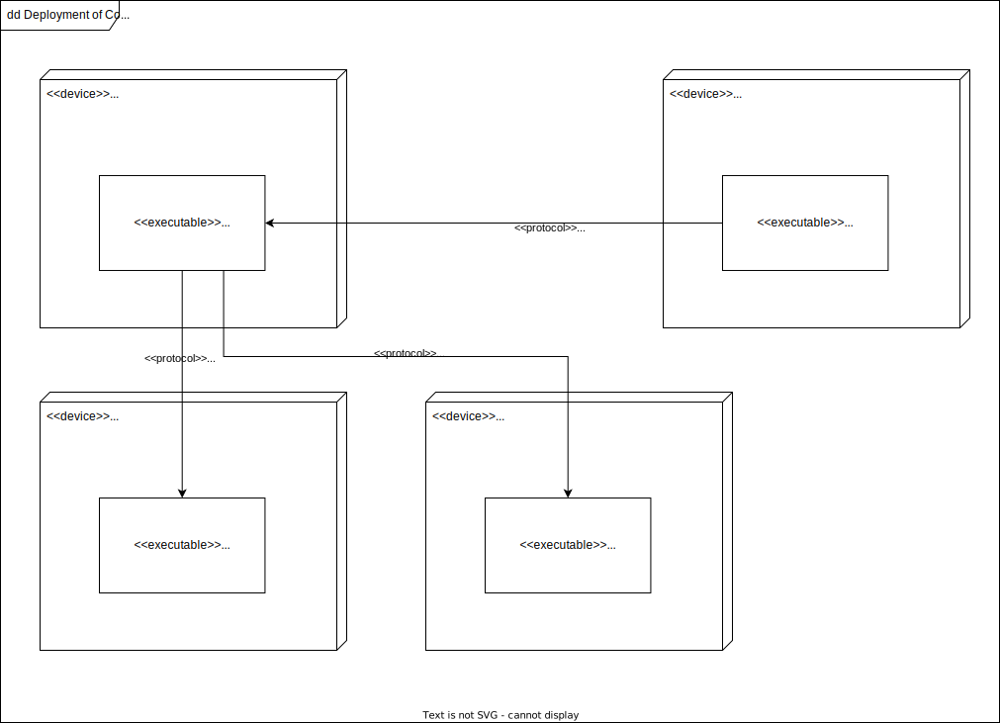

# Architecture

## Structure

## Concepts

### Validation & State Transitions

The general request validation is done in the REST controllers, as is the transition of states (e.g., joining rooms or
voting).
Integrity related validation is done in the persistence layer, such as clearing votes of observers.

The persistence layer is treated as the single-source-of-truth.

### Extensions

Extensions are primarily controlled using spring profiles that start with the prefix `extension:`. This is then
delegated to the web app.

## Guidelines

### Frontend

- For trivial components (buttons, cards), raw HTML should be preferred over React components, to keep complexity low.